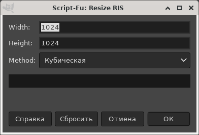

# Gimp Resize RIS Plugin

GIMP plugin for resize images using Reverse Interpolate Scale (RIS)

This plugin is designed to resize images according to the RIS rules,
according to which an enlarged image can be returned
to the original image by simple averaging.

Hints:
 * The plugin is located in : Menu -> Image -> Transform -> Resize RIS
 * Currently it all colormode images

Compare:

Origin:  
  
GIMP (cubic):  
  
RIS resize (cubic):  
  

## Install:

Copy `resize-ris.py` in:
* Linux: `~/.config/GIMP/2.10/plug-ins`
* Windows: `C:\Program Files\GIMP 2\lib\gimp\3.0\plug-ins`

or `resize-ris.scm` in:
* Linux: `~/.config/GIMP/2.10/scripts`
* Windows: `C:\Program Files\GIMP 2\lib\gimp\3.0\scripts`

----

Homepage: https://github.com/ImageProcessing-ElectronicPublications/gimp-plugin-resize-ris

2021
